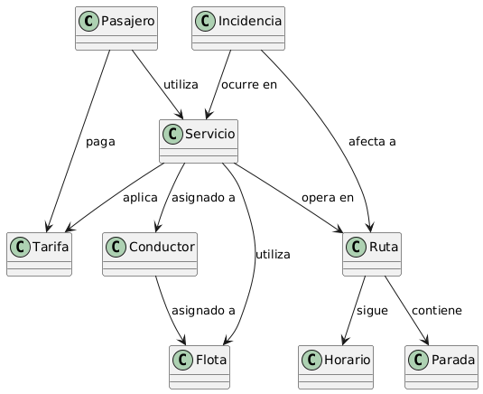
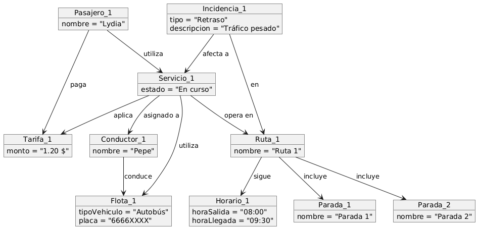
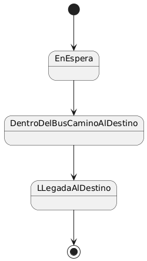
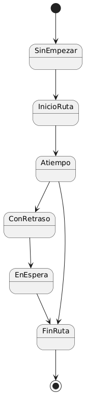
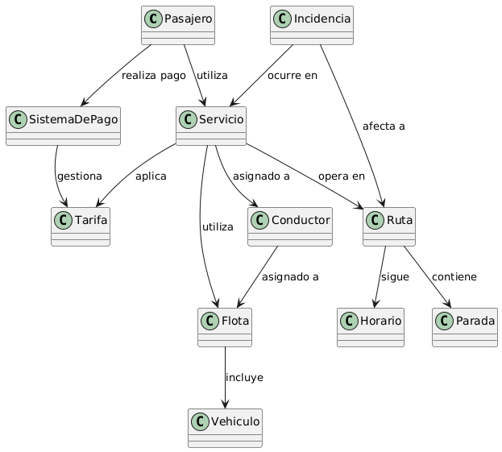
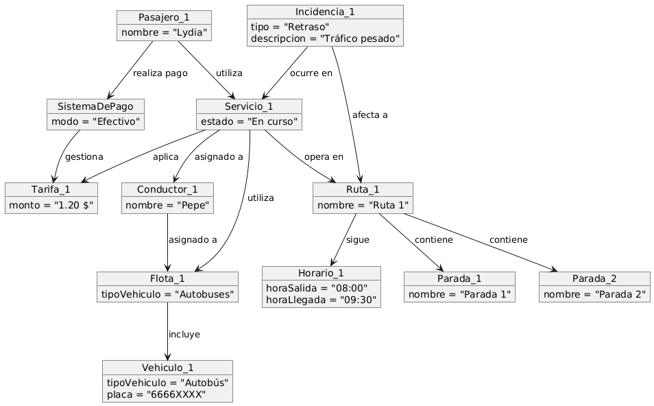
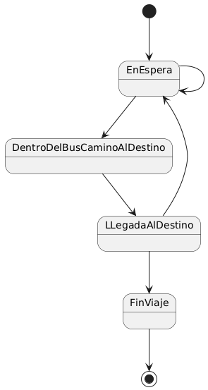
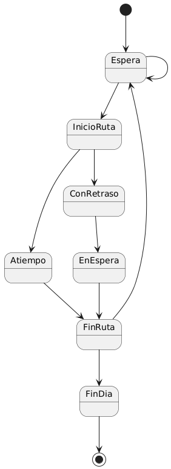

# Sistema de transporte público de una ciudad

[Mi examen](https://github.com/Ingenieria-Informatica-UNEATLANTICO/app-actividad-post-parcial-lydiaa-gr/blob/main/documents/parcialIngenieria.pdf)

---

## Modelo del dominio
|                    |  |
| ----------------------------- | ------ |
**Diagrama de Clases**       
|  
 |[Código](modelosUML/DiagramaClases.puml)|
| **Diagrama de Objetos**        
|  
 | [Código](modelosUML/DiagramaObjetos.puml) |
| **Diagrama de Estado del Pasajero** 
|  
 | [Código](modelosUML/DiagramaEstadosPasajero.puml) |
| **Diagrama de Estado de Ruta** 
|  
 | [Código](modelosUML/DiagramaEstadosRuta.puml) |

---
## Modelo del dominio iteración 1
|                    |  |
| ----------------------------- | ------ |
**Diagrama de Clases**       
|  
 |[Código](modelosUML/DiagramaClasesIteracion.puml)|
| **Diagrama de Objetos**        
|  
 | [Código](modelosUML/DiagramaObjetosIteracion.puml) |
| **Diagrama de Estado del Pasajero** 
|  
 | [Código](modelosUML/DiagramaEstadosPasajeroIteracion.puml) |
| **Diagrama de Estado de Ruta** 
|  
 | [Código](modelosUML/DiagramaEstadosRutaIteracion.puml) |

